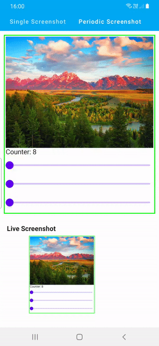

# Compose ScreenshotBox

[](https://jitpack.io/#SmartToolFactory/Compose-Screenshot)

Screenshot Composables and convert into Bitmap on user action or periodically.

| Single Shot | Periodic |
| ----------|-----------|
|  |  |

## Gradle Setup

To get a Git project into your build:

* Step 1. Add the JitPack repository to your build file Add it in your root build.gradle at the end
  of repositories:

```
allprojects {
  repositories {
      ...
      maven { url 'https://jitpack.io' }
  }
}
```

* Step 2. Add the dependency

```
	dependencies {
	        implementation 'com.github.SmartToolFactory:Compose-Screenshot:Tag'
	}
```


## Implementation

### Single Shot

Create a `ScreenshotBox` which covers your Composables you want to take screenshot of

```
ScreenshotBox(screenshotState = screenshotState) {
    Column(
        modifier = Modifier
            .border(2.dp, Color.Green)
            .padding(5.dp)
    ) {

        Image(
            bitmap = ImageBitmap.imageResource(
                LocalContext.current.resources,
                R.drawable.landscape
            ),
            contentDescription = null,
            modifier = Modifier
                .background(Color.LightGray)
                .fillMaxWidth()
                // This is for displaying different ratio, optional
                .aspectRatio(4f / 3),
            contentScale = ContentScale.Crop
        )

        Text(text = "Counter: $counter")
        Slider(value = progress, onValueChange = { progress = it })
    }
}
```

Provide a `ScreenshotState` which stores Bitmap

```
val screenshotState = rememberScreenshotState()
```

and take screenshot by clicking a button or calling `screenshotState.capture()`

```
Button(
    onClick = { 
        screenshotState.capture()
    }
) { 
    Text(text = "Take Screenshot")
}
```
And get `Bitmap` or `ImageBitmap` as

```
screenshotState.imageBitmap?.let {
    Image(
        modifier = Modifier
            .width(200.dp)
            .height(150.dp),
        bitmap = it,
        contentDescription = null
    )
}
```

initially `Bitmap` is null because `onGloballyPositioned` might not return correct coordinates or
sometimes it returns zero width or height, nullable makes sure that you get the latest one after
calling `screenshotState.capture()`

### Periodic Shot

Collect `screenshotState.liveScreenshotFlow` to get periodic screenshots of your composables with

```
LaunchedEffect(Unit) {
        screenshotState.liveScreenshotFlow.onEach {
            imageBitmap = it.asImageBitmap()
        }.launchIn(this)
    }
```

## ScreenshotState

Set a delay after each shot by setting `delayInMillis`

```
/**
 * Create a State of screenshot of composable that is used with that is kept on each recomposition.
 * @param delayInMillis delay before each screenshot if [liveScreenshotFlow] is collected.
 */
@Composable
fun rememberScreenshotState(delayInMillis: Long = 20) = remember {
    ScreenshotState(delayInMillis)
}

/**
 * State of screenshot of composable that is used with.
 * @param timeInMillis delay before each screenshot if [liveScreenshotFlow] is collected.
 */
class ScreenshotState internal constructor(
    private val timeInMillis: Long = 20
) {
    internal var callback: (() -> Bitmap?)? = null

    private val bitmapState = mutableStateOf(callback?.invoke())

    /**
     * Captures current state of Composables inside [ScreenshotBox]
     */
    fun capture() {
        bitmapState.value = callback?.invoke()
    }

    val liveScreenshotFlow = flow {
        while (true) {
            val bmp = callback?.invoke()
            bmp?.let {
                emit(it)
            }
            delay(timeInMillis)
        }
    }

    val bitmap: Bitmap?
        get() = bitmapState.value

    val imageBitmap: ImageBitmap?
        get() = bitmap?.asImageBitmap()
}

```